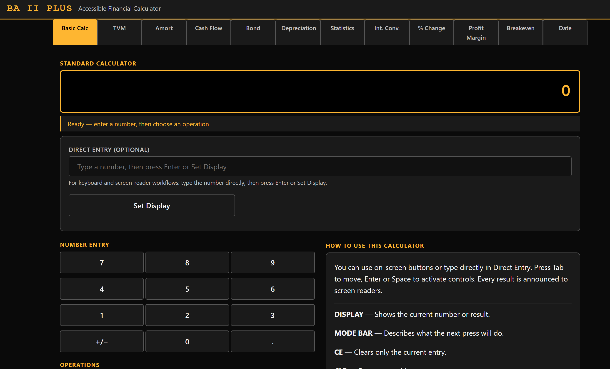

# BA II Plus Accessible Calculator (CFA, FRM and Other Competitive Finance Exams)

This project is a screen-reader-first, web-based replica of the Texas Instruments BA II Plus financial calculator. It is built specifically for blind and low-vision learners preparing for CFA, FRM and other competitive finance exams who need equivalent worksheet functionality without relying on inaccessible physical keypads.

[](https://www.python.org/downloads/)
[](LICENSE)
[](https://www.w3.org/TR/WCAG21/)
[](https://www.w3.org/TR/wai-aria-1.1/)

> **Live demo:** [ba-ii-plus-accessible.onrender.com](https://ba-ii-plus-accessible.onrender.com) *(free tier — may take ~30 s to wake on first visit)*

## Why this exists

Blind and low-vision candidates preparing for CFA, FRM and other competitive finance exams are often required to use approved calculator workflows, but the physical BA II Plus can be difficult or impossible to use non-visually at exam speed. This project provides a faithful, accessible learning and practice environment so users can study concepts and workflows with screen readers while preserving BA II Plus worksheet logic and sign conventions.

## Who this is for

- Blind and low-vision candidates preparing for CFA, FRM and other competitive finance exams
- Accessibility-focused finance learners
- Developers and researchers working on inclusive fintech tools

## Features

- 12 BA II Plus worksheets: Basic Calc (arithmetic + memory), TVM, Amortization, Cash Flow (NPV/IRR), Bond, Depreciation, Statistics, Interest Conversion, Percent Change, Profit Margin, Breakeven, Date
- WCAG 2.1 AA + WAI-ARIA 1.1 implementation in a Dash 4 UI
- Screen-reader-first interaction model with semantic headings and live regions
- Full keyboard navigation: arrow keys to switch worksheet tabs, Alt+T to jump to tab strip
- Backend formulas implemented in pure Python and verified against TI guidebook examples
- 231 tests total (`103` backend + `128` app/integration)

## Screenshot



## Project structure

- `src/app.py` — Dash UI, worksheet layouts, callbacks, ARIA behavior
- `src/calculator.py` — Pure Python formula engine (no UI dependencies)
- `src/assets/custom.css` — All styling in one place (no `html.Style()`)
- `src/assets/tab-keyboard-nav.js` — WAI-ARIA Tabs keyboard pattern (arrow keys, Alt+T shortcut)
- `tests/test_calculator.py` — Backend formula tests with summary output
- `tests/test_app.py` — App/integration tests for worksheet behavior

## Installation

> **Important:** This project uses a shared virtual environment (`.venv`) located at the **repository root** (`accessible_tools/.venv`), not inside the `ba-ii-plus` subdirectory. Always activate it before running the app or tests.

### Windows (PowerShell)

```powershell
# From the repository root (accessible_tools/)
python -m venv .venv
.\.venv\Scripts\Activate.ps1
python -m pip install --upgrade pip
pip install -r calculators/financial/ba-ii-plus/requirements.txt
```

If `requirements.txt` is not present in your branch, install core packages directly:

```powershell
pip install dash dash-bootstrap-components pytest
```

### macOS / Linux

```bash
# From the repository root (accessible_tools/)
python3 -m venv .venv
source .venv/bin/activate
python -m pip install --upgrade pip
pip install -r calculators/financial/ba-ii-plus/requirements.txt
```

Fallback install:

```bash
pip install dash dash-bootstrap-components pytest
```

## Run the app

Make sure the `.venv` is activated first (see Installation above), then:

```bash
cd calculators/financial/ba-ii-plus/src
python app.py
```

Open [http://localhost:8052](http://localhost:8052) (the URL is also printed in the terminal when the app starts).

## Run tests

Make sure the `.venv` is activated first, then from the project folder (`calculators/financial/ba-ii-plus`):

```bash
pytest tests/ -s -q
```

Use the `-s` flag. It is required to display the printed pass/fail output and summary table used by this project.

See [FORMULA_VERIFICATION.md](FORMULA_VERIFICATION.md) for detailed test verification against official TI manual examples.

## Known limitations

- Bond worksheet currently uses an approximation and may differ slightly from exact BA II Plus values shown in the TI manual (notably around p.56 examples).
- End-to-end browser automation tests are not included yet (current suite focuses on deterministic backend and callback-level logic).
- In Dash 4, `dcc.Input` does not currently support `aria-describedby` directly, so helper text association is partially constrained by framework behavior.

## Accessibility

- Compliance target: WCAG 2.1 AA and WAI-ARIA 1.1
- Details and verification process: see [ACCESSIBILITY.md](ACCESSIBILITY.md)
- Screen reader test steps: see [docs/screen-reader-testing-guide.md](docs/screen-reader-testing-guide.md)

## AI transparency

This project was built with substantial AI assistance and documents that contribution openly. See [AI_TRANSPARENCY.md](AI_TRANSPARENCY.md) for specifics.

## Contributing

Contributions are welcome, especially from screen reader users and candidates preparing for CFA, FRM and other competitive finance exams. See [CONTRIBUTING.md](CONTRIBUTING.md).

## Call to action

If you use NVDA, JAWS, VoiceOver, or prepare for CFA, FRM and other competitive finance exams with BA II Plus workflows, your feedback is high-impact. Please open issues for usability gaps, worksheet mismatches, and any accessibility blockers so this tool keeps improving for the community.
